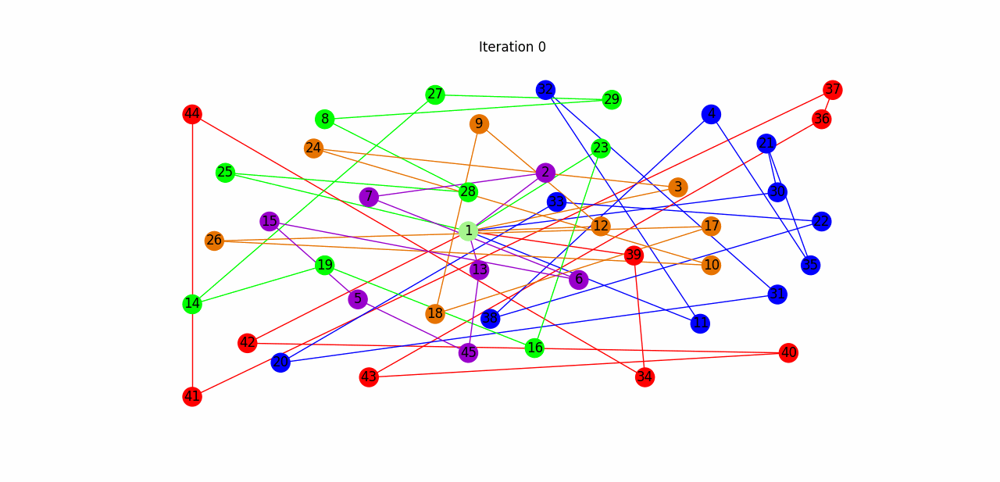

# AI50_CVRP

AI50 project to modelize **C**apacited **V**ehicle **R**outing **P**roblem (**CVRP**) and find solutions using Multi-Agents Systems, metaheuristics and Machine Learning.

## Requirements

This project requires a 3.8+ python version and multiple library to be runned. Before running it for the first time please ensure that you have every python library required by running the following command:

```shell
pip install requirements.txt
```

To be runned the application needs [Redis](https://redis.io/ 'redis.io') server available (version for windows and linux are present in the redis folder).

Finally, since the multi-agent algorithm as been written in  [sarl](http://www.sarl.io/ 'sarl programming language') you will need it in order to get a solution from this algorithm.

## Launching the web application

### Configuration 

You can add one or more of the followings arguments:

| Argument               | Explanation                                                  |
| ---------------------- | ------------------------------------------------------------ |
| -h or --help           | Display the help message                                     |
| -t or --unittest       | Run unit test before running the application                 |
| -s or --show_evolution | Display the current solution on the load page (not working yet) |

You may also change the configuration of the application in the file /gui/config.py. All parameters are in this file, and commented.

### Running it on local machine

To launch the web application, run the main.py file. Run the following command in the root file:

`python main.py`

The web application runned by default on http://localhost:8080/. 

## Implemented Algorithm

### Multi-Agents Systems (MAS)

The algorithm is based on the scientific article [Agents toward Vehicle Routing Problem](https://www.semanticscholar.org/paper/Agents-towards-vehicle-routing-problems-Vokr%C3%ADnek-Komenda/1d486f85f0810331c8feb203ac126a7c192d00e1 'SemanticScholar page'). It is written in [sarl](http://www.sarl.io/ 'sarl programming language') and bridged to python using redis to enable the communication.

### Meta-heuristcis

Two metaheuristics have been implemented:

- Tabu search
- Genetic Algorithm
- Grey Wolf Optimizer

Some metaheuristics start from a solution provided by the Clark & Wright saving algorithm and try to improve it. Here's a small example of the result provided by the tabu search algorithm.



The Grey Wolf Optimizer will build a solution without needing one at the very start. The algorithm is based on the scientific article [Using Grey Wolf Algorithm to Solve the
Capacitated Vehicle Routing Problem](https://iopscience.iop.org/article/10.1088/1757-899X/83/1/012014/pdf 'Grey Wolf Optimizer for CVRP') and the wikiversity page dedicated to the [Grey Wolf Algorithm](https://en.m.wikiversity.org/wiki/Algorithm_models/Grey_Wolf_Optimizer 'Grey Wolf Optimizer Wikiversity').

### Heuristics

As said previously we also use some heuristics to build a first solution for some of the meta-heuristics. Here's the list of implemented heuristics:

- Clark & Wright Saving Algorithm
- First Fit Decreasing (not available on the web gui)
- Nearest Neighbors (not available on the web gui)

### Learning algorithm

The last type of algorithm implement is an implementation of the capacited K-means. Note that this algorithm is not available from the web interface, but may be used from python.

